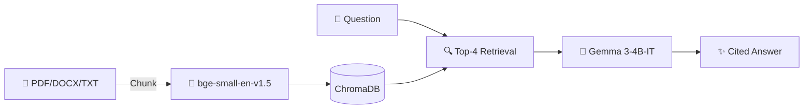

# Enterprise RAG + Agentic Automation

**Upload documents → Ask questions in plain English → Get cited answers in <5 seconds**

For Legal teams (contracts), Research labs (papers), FinOps departments (cloud spend).

---

## Architecture



---

## Quick Start

```bash
git clone https://github.com/pkgprateek/rag-document-qa-workflow.git
cd rag-document-qa-workflow

echo "OPENROUTER_API_KEY=your_key" > .env
docker compose up

# http://localhost:7860
```

[Get free API key](https://openrouter.ai/keys)

---

## Features

- Citation-backed answers from your documents
- Pre-loaded demos (Legal/Research/FinOps)
- Auto-deletes user data after 7 days
- Rate limiting + persistent storage included

---

## Privacy

Documents processed locally → ChromaDB storage → Auto-deleted after 7 days → Never used for training

---

## Consulting

**2-week paid pilots**: Ingest your documents, deploy on your infra, ROI analysis delivered.

📅 [Book discovery call](https://calendly.com/your-link-here)

---

**Demo**: [huggingface.co/spaces/pkgprateek/ai-rag-document](https://huggingface.co/spaces/pkgprateek/ai-rag-document)

**Contact**: [@pkgprateek](https://github.com/pkgprateek)
