# 🚀 Enterprise RAG Platform

**Question your documents. Get cited answers in seconds.**

Upload contracts, research papers, or financial reports → Ask questions in plain English → Get precise answers with page citations.

---

## How It Works

```mermaid
graph LR
    A["📄 Upload"] --> B["✂️ Chunk"]
    B --> C["🧠 Embed"]
    C --> D["💬 Ask"]
    D --> E["✨ Cited Answer"]
```



**3 steps**: Upload → Ask → Get answers with citations.

---

## Try It Now

1. **Select a vertical** (Legal, Research, or FinOps) — pre-loaded samples ready
2. **Ask a sample question** or type your own
3. **See the magic** — cited answers in seconds

No signup required. Your documents are processed locally and auto-deleted after 7 days.

---

## Features

- **Multi-format**: PDF, DOCX, TXT
- **Citations**: Every answer references source documents  
- **Domain demos**: Legal, Research, FinOps pre-loaded
- **Privacy-first**: Local processing, auto-delete after 7 days
- **Fast**: 1-3 second response time

---

## Run Locally

```bash
git clone https://github.com/pkgprateek/rag-document-qa-workflow.git
cd rag-document-qa-workflow
echo "OPENROUTER_API_KEY=your_key" > .env
docker compose up
# → http://localhost:7860
```

[Get free API key](https://openrouter.ai/keys) · [View source on GitHub](https://github.com/pkgprateek/rag-document-qa-workflow)

---

## 🔒 Privacy

- Documents processed locally (never sent externally)
- Stored in encrypted ChromaDB
- Auto-deleted after 7 days
- Never used for model training

---

## Enterprise Pilots

**2-week paid pilots** for teams ready to deploy RAG on their documents.

📅 [Book discovery call](https://cal.com/your-link)

---

**Built by [Prateek Kumar Goel](https://github.com/pkgprateek)** · MIT License
