# Enterprise RAG + Agentic Automation

> Document intelligence that actually works — Built for Legal, Research, and FinOps teams

[](https://huggingface.co/spaces/pkgprateek/ai-rag-document)
[](https://www.python.org/downloads/)

---

## One-Liner

**Upload contracts, papers, or cost reports → Ask questions in plain English → Get cited answers in <5 seconds**

Who it's for: Legal teams drowning in contracts, Research teams reviewing literature, FinOps teams analyzing cloud spend.

---

## Architecture Overview

```mermaid
graph LR
    A[📄 Documents<br/>PDF/DOCX/TXT] -->|Upload| B[🔪 Chunking<br/>1000 chars, 200 overlap]
    B --> C[🧠 Embeddings<br/>bge-small-en-v1.5<br/>384-dim vectors]
    C --> D[(🗄️ ChromaDB<br/>Vector Store)]
    
    E[💬 User Question] --> F[🔍 Retrieval<br/>Top-4 semantic search]
    D --> F
    F --> G[🤖 LLM Generation<br/>Gemma 3-4B-IT]
    G --> H[✨ Cited Answer]
    
    style A fill:#E0F2FE
    style D fill:#FEF3C7
    style H fill:#D1FAE5
```



**Key Components:**
- **Chunking**: Recursive text splitter with semantic boundaries
- **Embeddings**: BAAI/bge-small-en-v1.5 (best quality/speed ratio)
- **Vector DB**: ChromaDB with persistent storage
- **LLM**: Gemma 3-4B-IT via OpenRouter (free tier)
- **RAG Chain**: LangChain orchestration with citation tracking

---

## Quick Start (5 minutes)

### Option 1: Docker (Fastest)
```bash
git clone https://github.com/pkgprateek/rag-document-qa-workflow.git
cd rag-document-qa-workflow

# Add your OpenRouter API key
echo "OPENROUTER_API_KEY=your_key" > .env

# Run (single command!)
docker compose up

# Open: http://localhost:7860
```

### Option 2: UV (10x faster than pip)
```bash
git clone https://github.com/pkgprateek/rag-document-qa-workflow.git
cd rag-document-qa-workflow

# Setup
uv venv && source .venv/bin/activate
uv pip install -r requirements.txt

# Add API key
echo "OPENROUTER_API_KEY=your_key" > .env

# Run
python app/main.py
```

**Get OpenRouter API key**: [openrouter.ai/keys](https://openrouter.ai/keys) (Free tier available)

---

## Key Features

✅ **Multi-Format Support** — PDF, DOCX, TXT with intelligent parsing  
✅ **Citation-Backed Answers** — Every response includes source references  
✅ **Vertical-Specific Demos** — Pre-loaded samples for Legal/Research/FinOps  
✅ **Rate Limiting** — Built-in abuse prevention (10 queries/hour, configurable)  
✅ **Auto-Cleanup** — User documents deleted after 7 days  
✅ **Persistent Storage** — ChromaDB ensures data survives restarts  

---

## Privacy & Security

🔒 **Data Handling:**
- Documents chunked into text + embeddings
- Stored in local ChromaDB (not in cloud)
- User uploads auto-deleted after 7 days
- Sample documents persist for demos
- **Zero data used for model training**

🛡️ **Rate Limiting:**
- Default: 10 queries/hour per user
- Prevents API abuse
- Configurable in `app/rag_pipeline.py`

---

## Performance Metrics

| Metric | Value |
|--------|-------|
| **Processing Speed** | ~500ms per 1000-char chunk |
| **Retrieval Latency** | <100ms for top-4 results |
| **Answer Generation** | 2-5 seconds (OpenRouter dependent) |
| **Storage Efficiency** | ~10MB per 100-page document |

---

## System Design Deep Dive

Want to understand the internals? Read the technical deep dive:

📖 **[System Architecture & Design Decisions](https://github.com/pkgprateek/rag-document-qa-workflow)** (GitHub README)

Covers: Chunking strategies, embedding selection, vector DB comparison, LLM routing, production deployment.

---

## Consulting & Pilot Availability

I run **2-week paid pilots** for enterprise teams:

✅ **Week 1**: Ingest your documents (contracts, papers, reports)  
✅ **Week 2**: Deploy your instance, train your team, deliver ROI analysis  

**Deliverables:**
- Deployed RAG system on your infrastructure
- Custom chunking/retrieval tuned to your documents
- Performance benchmarks + accuracy metrics
- 30-day support + training sessions

📅 **[Book 15-min Discovery Call](https://calendly.com/your-link-here)**

**Sample pilots:** Legal team (500 contracts), Research lab (2,000 papers), FinOps dept (12 months invoices)

---

## Live Demo

**Try it now**: [https://huggingface.co/spaces/pkgprateek/ai-rag-document](https://huggingface.co/spaces/pkgprateek/ai-rag-document)

1. Click a vertical tab (Legal/Research/FinOps)
2. Load sample documents (one-click)
3. Try canned queries or ask your own
4. See cited answers in <5 seconds

---

## Technology Stack

| Component | Choice | Why |
|-----------|--------|-----|
| **RAG Framework** | LangChain 1.0.7 | Industry standard, best ecosystem |
| **Vector DB** | ChromaDB 1.3.4 | Lightweight, persistent, zero-config |
| **Embeddings** | BAAI/bge-small-en-v1.5 | Best accuracy/speed tradeoff |
| **LLM** | Gemma 3-4B-IT | Free tier, low latency |
| **UI** | Gradio 5.49.1 | Fast prototyping, HF integration |

---

## Contact

**Prateek Kumar Goel**

- 🌐 Live Demo: [HuggingFace Space](https://huggingface.co/spaces/pkgprateek/ai-rag-document)
- 💻 GitHub: [@pkgprateek](https://github.com/pkgprateek)
- 🤗 HuggingFace: [@pkgprateek](https://huggingface.co/pkgprateek)

---

**Built with production-grade MLOps practices** — Automated CI/CD, Docker deployment, enterprise security standards.
