# 🚀 Enterprise RAG Platform

**Question your documents. Get cited answers in seconds.**

[](https://pkgprateek-ai-rag-document.hf.space/)
[](https://github.com/pkgprateek/ai-rag-document/actions/workflows/deploy-to-hf.yml)
[](https://www.python.org/downloads/)
[](LICENSE)

<!-- Replace with actual screenshot: assets/demo-screenshot.png -->
<p align="center">
  <a href="https://pkgprateek-ai-rag-document.hf.space/">
    
  </a>
</p>

---

## Why This Matters

**Knowledge workers spend 2.5 hours daily searching for information** buried in documents. Enterprise RAG eliminates that friction—upload your contracts, research papers, or financial reports, ask questions in plain English, and get precise answers with page citations in under 5 seconds.

---

## Architecture

```mermaid
flowchart TB
    subgraph Ingestion ["📥 Ingestion"]
        A["📄 PDF / DOCX / TXT"]
        B["✂️ RecursiveTextSplitter<br/>1000 chars · 200 overlap"]
        A --> B
    end
    
    subgraph Indexing ["📊 Indexing"]
        C["🧠 bge-small-en-v1.5<br/>384-dim embeddings"]
        D[("💾 ChromaDB<br/>Persistent")]
        B --> C --> D
    end
    
    subgraph Retrieval ["🔍 Retrieval"]
        E["💬 Question"]
        F["🎯 Top-4 Similarity"]
        E --> F
        D --> F
    end
    
    subgraph Generation ["✨ Generation"]
        G["🤖 Gemma 3-4B-IT"]
        H["📝 Cited Answer"]
        F --> G --> H
    end
```



**Stack**: LangChain 1.0.7 · ChromaDB 1.3.4 · sentence-transformers · OpenRouter

---

## One-Minute Quickstart

```bash
# Clone and enter
git clone https://github.com/pkgprateek/rag-document-qa-workflow.git
cd rag-document-qa-workflow

# Set your API key (free from OpenRouter)
echo "OPENROUTER_API_KEY=your_key_here" > .env

# Run with Docker (recommended)
docker compose up
```

Open **http://localhost:7860** → Done.

<details>
<summary>Alternative: UV (10× faster than pip)</summary>

```bash
uv venv && source .venv/bin/activate
uv pip install -r requirements.txt
python app/main.py
```

</details>

🔑 [Get free OpenRouter API key](https://openrouter.ai/keys)

---

## Production Checklist

> 10 criteria for enterprise-grade RAG. Each is satisfied by this platform.

| # | Criterion | Status | Details |
|---|-----------|--------|---------|
| 1 | **Multi-format ingestion** | ✅ | PDF, DOCX, TXT with intelligent parsing |
| 2 | **Semantic chunking** | ✅ | 1000-char chunks, 200-char overlap |
| 3 | **Production embeddings** | ✅ | bge-small-en-v1.5 (MTEB optimized) |
| 4 | **Persistent storage** | ✅ | ChromaDB survives restarts |
| 5 | **Citation tracking** | ✅ | Every answer links to source chunks |
| 6 | **Rate limiting** | ✅ | 10 queries/hour (configurable) |
| 7 | **Privacy controls** | ✅ | Auto-delete after 7 days |
| 8 | **Domain demos** | ✅ | Legal, Research, FinOps samples |
| 9 | **Docker deployment** | ✅ | One-command production deploy |
| 10 | **Monitoring hooks** | ✅ | Health checks, error logging |

📖 **[Design Decisions →](docs/DESIGN_DECISIONS.md)** — Deep dive into architectural choices.

---

## Features

| Feature | Description |
|---------|-------------|
| 📄 **Multi-format** | PDF, DOCX, TXT with intelligent parsing |
| 🔗 **Citations** | Source references in every answer |
| 🏢 **Vertical demos** | Pre-loaded Legal/Research/FinOps samples |
| 🔒 **Privacy** | Auto-delete after 7 days, local processing |
| ⚡ **Fast** | 3-6 second end-to-end response time |
| 🐳 **Portable** | Docker-ready, one-command deploy |

---

## Performance

| Metric | Value |
|--------|-------|
| **End-to-end latency** | 3-6 seconds |
| **100-page contract** | 8s process, 3s query |
| **Hallucination rate** | ~4-7% (vs 18% baseline) |
| **Throughput** | ~12 docs/min |

---

## Consulting & Pilots

**2-week paid pilots** for enterprise teams:

| Week | Deliverables |
|------|--------------|
| **Week 1** | Ingest your documents, tune chunking for your domain |
| **Week 2** | Deploy on your infrastructure, team training, ROI analysis |

**Includes**: Custom RAG system · Performance benchmarks · 30-day support

<p align="center">
  <a href="https://cal.com/your-link">
    
  </a>
</p>

---

## Contact

**Prateek Kumar Goel**

[](https://huggingface.co/spaces/pkgprateek/ai-rag-document)
[](https://github.com/pkgprateek)
[](https://huggingface.co/pkgprateek)

---

<p align="center">
  <sub>
    MIT License · Built with production-grade MLOps practices
  </sub>
</p>
