# Enterprise RAG Platform

<div align="center">

**Turn documents into answers. Instantly.**

Upload contracts, research papers, or financial reports. Ask questions in plain English. Get precise, cited answers in seconds.

[](https://pkgprateek-ai-rag-document.hf.space/)
[](https://github.com/pkgprateek/ai-rag-document/actions/workflows/deploy-to-hf.yml)
[](https://www.python.org/downloads/)
[](LICENSE)

<a href="https://pkgprateek-ai-rag-document.hf.space/">
  
</a>

</div>

---

## The Problem

Knowledge workers spend **2.5 hours daily** searching for information buried in documents. Legal teams review contracts manually. Researchers dig through papers. Finance teams hunt for clauses in agreements.

## The Solution

**Enterprise RAG** eliminates that friction:

```
Upload documents → Ask questions → Get cited answers in <5 seconds
```

No more Ctrl+F. No more reading 50 pages to find one clause. Just ask.

---

## Features

| Feature | What You Get |
|---------|--------------|
| **Multi-document upload** | Process multiple files at once with batch progress |
| **Streaming answers** | Watch answers generate in real-time with thinking indicator |
| **Inline citations** | Every claim linked to source document + page number |
| **3 AI models** | GPT-OSS 120B, Llama 3.3 70B, Gemma 3 27B |
| **Session isolation** | Your documents are private to your session |
| **Auto-cleanup** | Documents auto-deleted after 7 days |

---

## Architecture

```mermaid
flowchart LR
    subgraph Input
        A[📄 PDF / DOCX / TXT]
    end
    
    subgraph Processing
        B[✂️ Chunk<br/>1000 chars]
        C[🧠 Embed<br/>bge-small-en-v1.5]
        D[(💾 ChromaDB)]
    end
    
    subgraph Query
        E[💬 Question]
        F[🎯 Top-4 Retrieval]
        G[🤖 LLM Stream]
        H[📝 Cited Answer]
    end
    
    A --> B --> C --> D
    E --> F --> G --> H
    D --> F
```



**Stack:** LangChain · ChromaDB · sentence-transformers · Groq + OpenRouter

---

## Quick Start

### Docker (Recommended)

```bash
git clone https://github.com/pkgprateek/rag-document-qa-workflow.git
cd rag-document-qa-workflow

# Add your API keys
echo "GROQ_API_KEY=your_key" > .env
echo "OPENROUTER_API_KEY=your_key" >> .env

docker compose up
```

Open **http://localhost:7860**

### Local Development

```bash
uv venv && source .venv/bin/activate
uv pip install -r requirements.txt
python app/main.py
```

**Get Free API Keys:**
- [Groq](https://console.groq.com/keys) — Required (GPT-OSS, Llama)
- [OpenRouter](https://openrouter.ai/keys) — Optional (Gemma)

---

## Performance

| Metric | Value |
|--------|-------|
| **Query latency** | 50-200ms (p95) |
| **Document processing** | 3-4s for 100 pages |
| **Citation accuracy** | 93-96% relevance |
| **Streaming** | First token in <500ms |

---

## Enterprise Pilots

**2-week paid pilots** for teams ready to deploy RAG on their infrastructure:

| Week | Deliverables |
|------|--------------|
| **Week 1** | Document ingestion, chunking tuned for your domain |
| **Week 2** | Deployment, team training, ROI analysis |

**Includes:** Custom RAG system · Performance benchmarks · 30-day support

<p align="center">
  <a href="https://cal.com/prateekgoel/30m-discovery-call">
    
  </a>
</p>

---

## Contact

**Prateek Kumar Goel**

[](https://huggingface.co/spaces/pkgprateek/ai-rag-document)
[](https://github.com/pkgprateek)
[](https://huggingface.co/pkgprateek)

---

<p align="center">
  <sub>MIT License · Built with ❤️ for enterprise document intelligence</sub>
</p>
